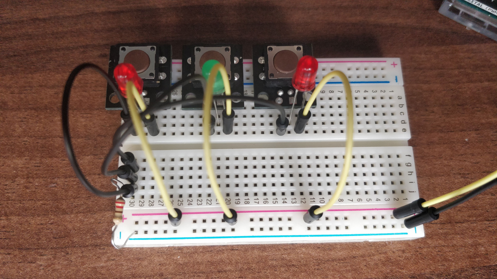
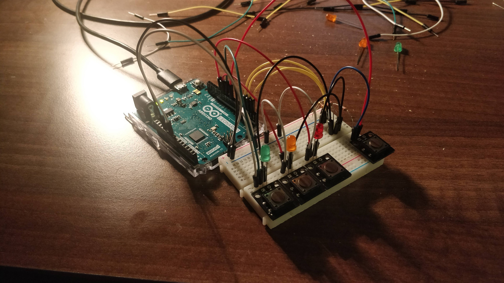
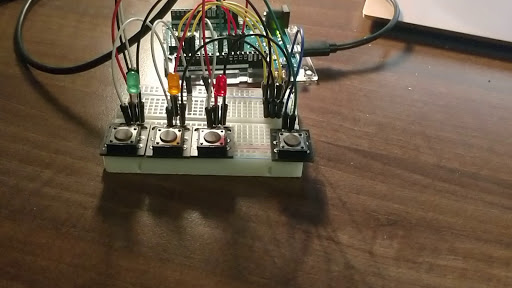

# week one documentation

## Assignment: Simon Says

The assignment of this week was to create a Simon Says type game with three levels, using buttons and LEDs. After failing to come up with a better idea for a game, I decided to just implement the assignment before getting too creative.

## designing the circuit

After getting myself familiarized with the general workings of Arduinos, the first task was to design the circuit for the game.

I began by building a circuit with three LEDs that could be lit up with three buttons. My initial design for such a circuit looked like this:

The next step was adding the ability to programmatically control the LEDs. To achieve this, I needed to create a parallel circuit to the LEDs, powering them either through a button press closing the circuit or the power of an output port.
The last thing to add was the input ports that register when the buttons are pressed. While I was at it, I created another button to an input port that would function as the restart button.
Final design looked like this:

(click on the image for a video of the working circuit!)

Once I had that down, the rest was software!

## programming the game logic

After creating the circuit logic, the next challenge was programming the actual game logic. Here's a couple of issues that I ran into:

First of all, I wanted to use a flexible size array to store the light combinations and user inputs. Unfortunately, the C++ core language doesn't include such a datatype by default, so I had to import an Arduino port of STL (Standard Template Library) which includes various list datatypes such as vectors and lists.
Another challenge was detecting inputs. Since a button press produces a continuous stream of "HIGH" signals, it is a bit tricky to tell if a button was pressed twice. I guess one could solve that problem by adding a debounce to the button press (in hindsight, this was probably the more "correct" solution). But I decided to just bypass the whole problem altogether by generating my blinking sequence in such a way that it doesn't repeat the same color twice in a row.
Other than that, the game logic was rather straightforward. Here's a video of the final result:

## lessons learned

A couple of lessons that I learned while building this game:

- don't change the circuit while the Arduino is connected the power
- don't forget to use resistors!

In the beginning, I did both of those a bit more often than I would like to admit 😅.
