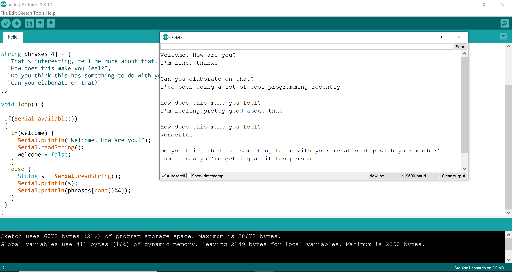

# week two documentation

## Lab 00 - LEDs in Serial and Parallel

- How many LEDs can you hook up with a 220 Ohm resistor in serial before running out of voltage?

Through experimentation we found out that you can't hook up more than one LED. Running through the math, this seems to make sense, if one LED uses up around 3V, then two LEDs should be too much for a 5V circuit to light them in series.

- How many LEDs can you hook up with a 220 Ohm resistor in parallel before running out of voltage?

We tried hooking up as many LEDs as we could in parallel, but gave up after 6. When trying to do the math, it became apparent that's actually a trick question - in a parallel circuit, the voltage never actually runs out, all LEDs in parallel will get the full 5V. As long as you have a strong enough power supply, you can light as many LEDs in parallel as you want.

## Lab 01 - Serial Data

For the lab exercise two I decided to play around and create an ELIZAesque chatbot that responds to every user input with a psychologically sounding question. Here's a screenshot of how an example conversation might go:

You can see the code for this example under `serial_data/serial_data.ino`.

## Lab 02 - 04

I did the rest of the exercises together in a group.
Unfortunately I didn't realize we were supposed to take pictures of the labs, so this section looks kind of empty for this week... I'm sorry, I promise there will be more pictures for next week!
