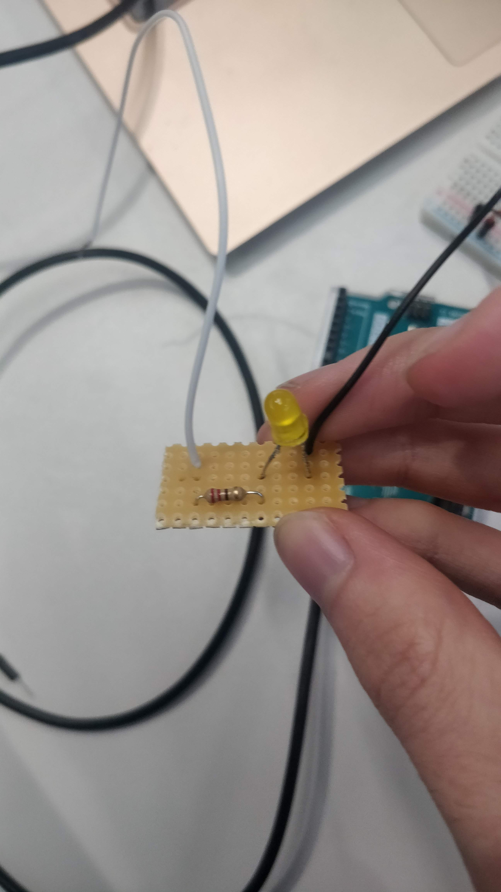
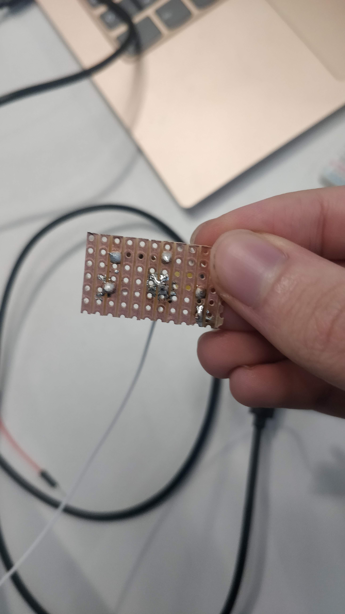
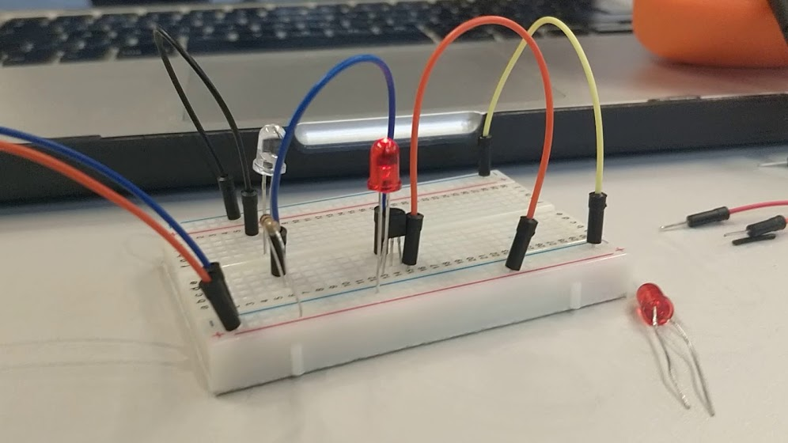

# week three documentation

## playing with fades

The final version of the soldered board:

And here you can see a [video of the working circuit](https://photos.app.goo.gl/cTGLG6gLgEbxG7CdA).

## measuring a the voltage of a voltage divider

Even though it wasn't required, here's a [video of us measuring the voltage](https://photos.app.goo.gl/EDT3XseBgZxmbN7m8) of in a circuit with a voltage divider.

## dark detecting LED

(click on the image of the video)
