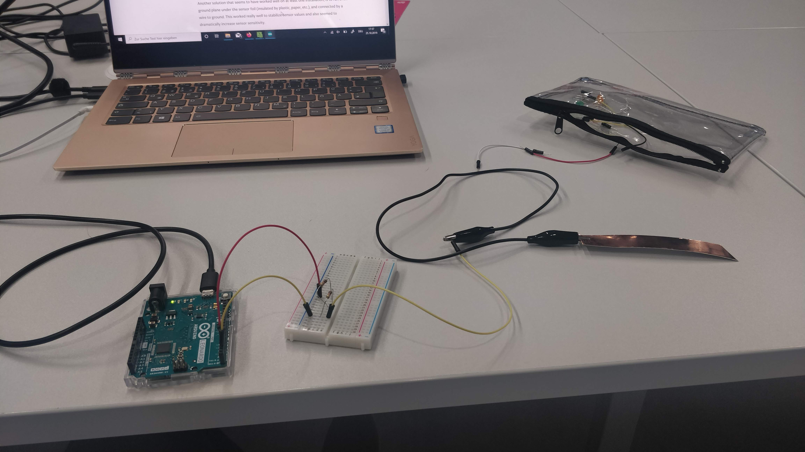

# week three documentation

## lab 2 - hooking up a servo

## lab 3 - hooking up a motor

Had some problems with the wiring, turned out there was a faulty wire (thanks again for helping us with that one, Phoenix!)

## lab 4 - hooking up an MPR121

## lab 5 - CapSense library

The last part of this week's lab was the Capacitive Sensing Library. Even though the basic example was rather straightforward, it took me a while to get it working. (As it turns out, the library has problems with detection when the laptop isn't plugged in to power...)

Here you can see a circuit for the basic working example:

noticed a weird quirk with the measurement; it goes negative when I touch my laptop
decided to send the serial data to processing and make a processing sketch that displays a face depending on whether the computer is touched or not.

